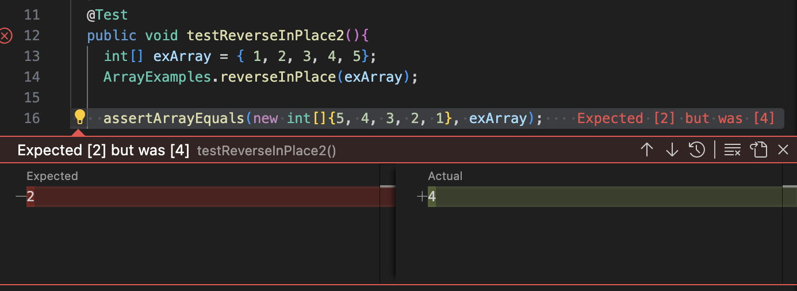

# Lab Report 2 
## Aidan Rikic

**Part1**   
I'm choosing `reversedInPlace` in `ArrayExamples`  
1.  
`@Test 
  public void testReverseInPlace2(){
    int[] exArray = { 1, 2, 3, 4, 5};
    ArrayExamples.reverseInPlace(exArray);
    assertArrayEquals(new int[]{5, 4, 3, 2, 1}, exArray);
  }`  
2.  
`@Test 
	public void testReverseInPlace() {
    int[] input1 = { 3 };
    ArrayExamples.reverseInPlace(input1);
    assertArrayEquals(new int[]{ 3 }, input1);
	}`  
3.  

  
4.  
Failing code:  
`static void reverseInPlace(int[] arr) {
    for(int i = 0; i < arr.length; i += 1) {
      arr[i] = arr[arr.length - i - 1];
    }
  }`  
Working Code:  
`static void reverseInPlace(int[] arr) {
    int[] placeHolder = arr.clone();
    for(int i = 0; i < arr.length; i += 1) {
      arr[i] = placeHolder[arr.length - i - 1];
    }
  }`  
5.  
The issue with the original code was that it was changing the array as it was iterating through the array. This changes the ints in the array before they are even swapped, and therefore messes up the back half of the array. In order to fix this, we create a placeholder array and swap the numbers there `arr` isn't affected while iterating through. 

**Part2**  
1.  
Command: `grep -r`
Directory Example:  
`aidan_rikic@Aidans-MacBook-Air docsearch % grep -r "biomed" ./technical/biomed
./technical/biomed/1471-2202-2-9.txt:        http://www.biomedcentral.com/1471-2202/2/8). It is now
./technical/biomed/1472-6882-3-3.txt:        literature search in biomedicine depends on the appropriate
./technical/biomed/1472-6882-3-3.txt:        The controlled vocabulary for biomedicine has been
./technical/biomed/1472-6882-3-3.txt:        biomedical literature [ 3 ] . With the recent development
./technical/biomed/1472-6882-3-3.txt:        Other biomedical databases that include CAM literature,
./technical/biomed/1472-6882-3-3.txt:          biomedicine and it has a subset focusing on complementary
./technical/biomed/1472-6882-3-3.txt:          biomedicine, investigators and authors in the fields of
./technical/biomed/1471-2202-2-8.txt:          paper http://www.biomedcentral.com/1471-2202/2/9), and
./technical/biomed/1472-6947-3-8.txt:          Creators of biomedical databases use terminologies to
./technical/biomed/1472-6947-3-8.txt:        biomedical data sets. Public comment is welcomed.
./technical/biomed/gb-2001-2-4-research0012.txt:        biomedicine of the visual computer language paradigm [ 24,
./technical/biomed/gb-2001-2-4-research0012.txt:        to biomedical education, investigation and industry. For
./technical/biomed/gb-2003-4-7-r46.txt:        gene annotations or concepts from the biomedical
./technical/biomed/1471-2474-2-3.txt:        http://www.biomedcentral.com/1471-8219/2/5
./technical/biomed/1475-9276-1-3.txt:        33 34 ] . This model has been widely applied in biomedical
./technical/biomed/1472-6807-1-1.txt:        types of ligands could therefore have important biomedical
./technical/biomed/1472-6920-2-3.txt:        international journals [ 5 ] . For biomedical disciplines
./technical/biomed/1471-2105-3-17.txt:        study aimed at enabling the biomedical community to cope
./technical/biomed/1471-2105-3-16.txt:        The availability of biomedical literature in electronic
./technical/biomed/1477-7827-1-54.txt:        study increases the biomedical significance of findings
./technical/biomed/1471-2164-3-7.txt:        of biomedical research. These include, but are by no means
./technical/biomed/1471-2164-3-18.txt:          in Gel/Mount (biomeda) containing 4',6
./technical/biomed/1472-6882-1-12.txt:        biomedical framework. While the SR method has been used in
./technical/biomed/1472-6947-3-5.txt:        another level of biomedical data integration in which array
./technical/biomed/gb-2003-4-4-r28.txt:        biomedical research community. GoMiner is flexible both`  

Explanation: The `grep -r` command allows us to search recursively through certain directories and their subdirectories for files that contain the specific string given. 

File Example:  
`aidan_rikic@Aidans-MacBook-Air docsearch % grep -r "biomed" ./technical/biomed/1471-2202-2-9.txt 
./technical/biomed/1471-2202-2-9.txt:        http://www.biomedcentral.com/1471-2202/2/8). It is now`  

Explanation: When we add a file to the end of the path, the `grep -r` command only searches through that specific file. This makes it a little less meaningful then searching through all the directories.  

2.  
Command: `grep -n`  
Directory example:
`aidan_rikic@Aidans-MacBook-Air docsearch % grep -n "the" ./technical/government
grep: ./technical/government: Is a directory`

Explanation: The command `grep -n` searches within files only, and returns lines in a file that contan the string given and the number of the line.  

File example:  
`aidan_rikic@Aidans-MacBook-Air docsearch % grep -n "the" ./technical/government/Alcohol_Problems/Session2-PDF.txt 
9:Many patients in the emergency department (ED) have alcohol
10:problems, and they can be identified.1 Research on techniques used
11:to identify these patients has been conducted, but several areas of
12:interest should be addressed by further research. We need to
13:further examine and refine alcohol-screening questionnaires in the
14:ED. We need to determine the sequence and combination of questions
15:and tests that constitute the best screening process. We need to
17:screening implementation, and demonstrate the impact of a screening
18:program in the ED. The final aim of screening must be improved
20:the first step in a process of care.
24:We must be careful when interpreting the results of studies, and in
25:our own design of screening procedures, that we are clear about the
26:endpoints we are measuring. Clinicians in the ED are interested in
34:Association in DSM III-R, IV2 and the World Health Organization
35:(WHO) in the 9th and 10th International Classification of Diseases
40:cases of alcohol abuse meet the ICD-10 definition. In general, an
41:alcohol use disorder is present when an aspect of the patient's
44:consumption occurs. Much of the emphasis of screening has shifted
59:ways. For a screening test, high sensitivity is the most desirable
60:parameter. High sensitivity ensures that most of the patients with
63:trade off between sensitivity and specificity defined by the
64:receiver operator curve. The area under the operator curve best
65:reflects the performance of a test; the larger the area the better
66:the test. Each point on the curve represents a potential "cut
70:the alcohol use spectrum. However, real tests don't perform
86:some subgroups than others based of the different case rates among
88:An ideal test should remain accurate in the presence of common
90:other drug use, depression, and anxiety disorders. Many of the
91:screening tests were developed outside the ED. Fortunately, many
92:have been applied to ED populations. Hence, their performance has
93:been demonstrated in the presence of some of these distracting
97:studies of screening tests in the ED.7,8 An ideal test in the ED
101:In research trials, the impracticality of a screening test may
104:In clinical practice, several practical issues will make all the
112:patients may find certain questions offensive, or they may not be
117:Payers may pay for some tests and not others. These and other
118:factors may reduce the effectiveness of a screening procedure that
121:minutes). Most of the quest to develop efficient ED screening has
124:with the routine sequence of medical history, physical examination,
126:confidential since there may be legal, financial, or social
127:consequences to screening positive. Finally, the ideal test should
128:actually motivate the patient to further assessment, counseling, or
140:Clinicians often use their general impression to help with
145:patients with alcohol problems. Unfortunately, the majority of
146:physicians (54%) screen only those patients they suspect based on
147:their clinical impressions.14-16 Stereotypic profiling may be the
155:a sensitivity of 29% for alcohol problems in the ED.7
160:sensitivity (40% to 70%).18 Subsequent reports from other
161:institutions did not replicate the high sensitivity of this single
162:question.19-23 Cherpitel evaluated single question screens in the
163:ED and found them to be less sensitive than structured
170:problems over the patient's lifetime. CAGE takes 1 to 2 minutes to
175:addresses problems over the patient's lifetime. MAST requires 20
176:minutes to administer. A shortened version of the MAST exists, a
178:administer and performs nearly as well as the longer
182:has 35 yes/no questions. While lengthy, the SAAST has the advantage
184:computerized format. It addresses problems over the patient's
185:lifetime. A shortened, 9-item version, the Brief SAAST, takes the
188:drinkers. WHO developed the AUDIT (Alcohol Use Disorder
191:has 10 questions. It assesses problems experienced within the last
192:three months and over the patient's lifetime. AUDIT takes 4 to 8
196:prompted development of the screens TWEAK, T-ACE, and NET. TWEAK
198:addresses problems over the patient's lifetime, and takes 3 to 5
200:dependence. T-ACE has three of the four CAGE questions and replaces
201:the guilt question with tolerance question. T-ACE addresses
202:problems over the patient's lifetime and takes 1 to 2 minutes to
206:One screen has been developed for emergency department use, the
209:created RAPS4 by combining the four highest-yield questions from
214:In addition to these questionnaires, NIAAA suggests that all
217:and then the CAGE. This sequence was not explicitly designed or
218:studied as a "screening test." D'Onofrio and others have
219:recommended using the NIAAA approach in the ED.10
222:tests in the ED. In the first study, TWEAK and AUDIT were most
224:an ICD-10 diagnosis of alcohol dependence.7 In the second study,
232:reviewed 38 studies of screening for alcohol use disorder in the
237:best within the spectrum of alcohol use they were developed to
246:acculturation, and non-dependent drinkers.36 Lowering the cut point
247:on these screening instruments improved sensitivity without loss of
252:were the best tests for alcohol dependence among women. Their
261:addition to women, other subgroups such as adolescents, older
264:may not perform as well in these patient subgroups that may
265:represent a considerable part of the ED population. Adjustment of
267:for these subgroups.
277:self-reported drinking.7 In another ED study, a saliva alcohol
282:Other biochemical markers such as mean corpuscular volume, platelet
287:problematic con-sumption.45-50 Biochemical tests other than BAC may
288:have use in settings other than an ED, but they offer little as
292:We still need to find the most accurate test for ED use. This
293:may be RAPS4, which is designed for the ED, but it needs further
295:to address current problems (the past year or three months) rather
298:and other groups.20,51-53 These approaches need further testing in
299:the ED.
300:The most practical test may be the shortest, the three-question
301:NET. Further sequencing of questions within questionnaires may also
304:the score is positive would be the most efficient approach.
305:Cherpitel has analyzed the sensitivity of each of the RAPS4
306:questions and sequenced them from most to least sensitive for most
315:interaction) should be undertaken to compare their cost and value
316:in the ED.
318:and confronting patients with their blood alcohol levels may
319:actually push them away from counseling. Screening questions that
320:reveal the negative consequences or link alcohol to current
322:immediate feedback may help make the transition from screening to
326:Research questions: finding the best approach to screening
327:To determine the best of the available screens, a multi-center
329:subjected to different screens is needed. Further evaluation should
333:determined. RAPS4 must be further tested as a stand-alone screen in
334:isolation and against other tests. A longer, self-administered
336:in the ED.
337:To determine the best sequence for screening, the approach
338:recommended by NIAAA for primary care should be compared with other
339:sequences. Several trials of variations of the NIAAA approach are
340:warranted. Trials should be conducted starting with other or no
341:opening questions, using other consumption questions such as those
342:in AUDIT, using other screens such as TWEAK rather than CAGE,
343:changing the sequence to CAGE or TWEAK followed by consumption
344:questions, and checking BAC at the beginning or end of the
346:The best screen should be determined in the context of a
348:lead naturally to referral and treatment. Others may not promote
349:referral and treatment. Much of the screening literature is
354:all emergency patients with CAGE and then provide feedback. Only
355:20% of patients were screened. Of them, 19% had positive CAGE
358:were entered into the trial and the trial was abandoned.65,66
361:perceived value to the intervention. In a survey sponsored by the
362:West Virginia Chapter of the American College of Emergency
373:chooses to screen some individuals and not others based on clinical
379:the ED, there are even higher case rates in subgroups. Major
383:screening on some of the highest-risk groups or screening with
384:greater intensity and different tools in these groups.
386:Any ED staff member could be assigned the screening task.
395:practice should be determined by studying the implementation of
396:these strategies in actual ED clinical practices. Studies of the
403:the lack of counseling available to address patients' alcohol
408:the screening program to some form of counseling, onsite or through
411:volume of alcohol-involved patients, and the capacity to undertake
412:clinical trials. Studies in these centers should demonstrate the
418:has not been developed. Researchers must continue to analyze the
420:screening tools in the ED. The sequence of screening tests needs to
421:be evaluated by studying the NIAAA approach and several
435:3. Spitzer R, Williams J, Gibbon M, et al. User's Guide for the
443:the CAGE, the Brief Michigan Alcoholism Screening Test, and the
447:use in a prenatal population (on a Northern Plains Indian
450:7. Cherpitel C. Screening for alcohol problems in the emergency
454:regions of the country. Alcohol Clin Exp Res 1997;21:1391-7.
459:alcohol problems in the emergency department, part 1: improving
462:the breath alcohol analyzer. Ann Emerg Med 1984;13:516-20.
464:of the breath alcohol analyzer. Ann Emerg Med 1986;15:349-53.
476:with the Alcohol Use Disorders Identification Test (AUDIT) in an
482:questions in the detection of alcoholism. JAMA 1988;259:51-4.
491:drinkers: lack of sensitivity of the two-question drinking test. Am
496:24. Ewing J. Detecting alcoholism: the CAGE questionnaire.
502:version of the Michigan Alcoholism Screening Test. Am J Psychiatry
504:27. Selzer M. The Michigan Alcoholism Screening Test: the quest
511:analysis of the Self-Administered Alcoholism Screening Test.
522:Development of the Alcohol Use Disorders Identification Test
530:drinking in the emergency room: the RAPS4. Rapid Alcohol Problems
536:the CAGE, the Brief Michigan Alcohol Screening Test, and the
544:dependence in the emergency room. Alcohol Clin Exp Res
547:instruments for alcohol problems in the emergency room. J Stud
552:Alcoholism. Criteria for the diagnosis of alcoholism. Am J
584:validation of the SDDS-PC screen for multiple mental disorders in
598:Cigarette, alcohol, and other drug use by school-age pregnant
611:and the risk of alcohol dependence. Addiction 1993;88:1209-18.
613:Alcoholism screening in the elderly. J Am Geriatr Soc
615:62. Bercsi S, Brickner P, Saha D. Alcohol use and abuse in the
625:to the conduct of a randomised controlled trial of problem drinkers`  

Explanation:  the command `grep -n` becomes useful here, allowing us to find all the lines within `Session2.pdf.txt` that contain the string `the`  

3.  
Command: `grep -v`
Directory example:
`aidan_rikic@Aidans-MacBook-Air docsearch % grep -v "pmed" ./technical/plos
grep: ./technical/plos: Is a directory`

Explanation: The command `grep -v` is used to find every line within a file that doesn't contain the given string. Therefore it cannot be used on directories
File example:  
`aidan_rikic@Aidans-MacBook-Air docsearch % grep -v "the" ./technical/plos/journal.pbio.0020001.txt
        countries, asserting that “This unbalanced distribution of scientific activity generates
        development itself.” Indeed, Mr. Annan's sentiments have also been echoed recently by
        Goldemberg 1998; Riddoch 2000). For example, recent United Nations Educational, Scientific,
        produced annually, with 36.6% and 37.5%, respectively, worldwide (UNESCO 2001).
            publications produced annually.
        developing worlds actually remaining unchanged or even increasing, as Mr. Annan has
        developing countries. For example, Latin America and China, although representing,
        (26%). The percentage of global scientific publications from North America actually
        lion's share (84.2%), followed by Canada (10.35%). Latin America as a whole contributed
        2002).
        assessing scientific productivity or technical advances (May 1997). More relevant
        invested in research and development for each region, also show that, in contrast to both
        of publications per amount of money allocated to research and development in Latin America,
        particularly from 1995 until 2000 (Figure 2).
        demonstrate that such developing regions as Latin America are making substantial
        product (GDP) invested in science in Latin America throughout this 10-year period was only
        concluded that, as a group, Latin America could afford to invest a much higher proportion
        of its resources in scientific research and development. Latin American investment in
        rate as well as in financial investment in science and technology. Some countries have
        performed particularly well. For example, Uruguay, Chile, Panama, and Cuba averaged,
        respectively, 6.8, 5.3, 5.2, and 3.4 publications per million dollars of research and
            development been increasing in Latin America while decreasing in United States and
            Canada?
        which are mutually exclusive. It is possible that publishing in international journals as a
        measure of scientific productivity is becoming more important in Latin America. Increased
        might have been an important stimulus. International cooperation resulting in more
        United States could reflect a trend towards more costly research in larger scientific
        programs.
        Scientific Impact from Latin America
        journals (
        Nature and 
        Science ; with impact factors of 27.96 and 23.33, respectively) and in
        that region. Thus, more than one region would receive credit for a single publication if
        that publication had been written by multiple authors from institutions of different
        regions.
        however, Latin America represented only 6%, while Canada and United States accounted,
        Canada across all subject areas in 
        Science and 
        In 
        Science and 
        However, publishing in 
        Science and 
        from North America (73%) and Europe (21%) (ISI 2001b). No researcher working in a Latin
        publications per researcher funding amount. Similar findings were also reported for Asia
        papers to become a highly cited scientist. It requires attending international meetings and
        activities, however, requires a greater proportion of research money being spent on
        A Long Road Yet to Travel
        The positive trends in scientific productivity in Latin America should not be
        developing world (Goldemberg 1998; Annan 2003). One is that science, as a discipline, would
        dominated by two geographic regions. Many scientific problems could be solved much more
        areas of concern that are having a proportionally greater scientific and social impact upon
        Brazil (Goldemberg 1998) and biomedical sciences in Cuba (Castro Díaz-Balart 2002). These
        world.
            input from those developing regions that are so important for global processes.
        direction. The extremely high scientific productivity of many developing nations, corrected
        built.`  
	
Explanation: the command `grep -v` is used to print every every line within a file that doesn't contain the string `"the"`. Here it is useful to find sentences that don't use the.  

4.  a
Command: `grep -e`
Directory example:
`aidan_rikic@Aidans-MacBook-Air docsearch % grep -e "bcr" -e "cc" ./technical/biomed
grep: ./technical/biomed: Is a directory`

Explanation: The command `grep -e` allows you to search for multiple different strings within a file. Here we tried searching for lines containing `"bcr"` and `"cc"` but got an error because it can only search within files not directories.  

File example:  
`aidan_rikic@Aidans-MacBook-Air docsearch % grep -e "whistleblower" -e "whistleblowers" ./technical/plos/pmed.0020281.txt
        In the lonely and, at times, discouraging world of whistleblowing, we whistleblowers are
        might make. Truth is the basis for the power of a whistleblower, one that can withstand the
        A whistleblower's success depends upon competent and articulate media. The debate to
        this is to have succeeded [as a whistleblower].”`  
	
Explanation: The command `grep -e` allows you to search for multiple strings within a file at once. Here it is useful to lookup mutliple different types of whistleblower like `"whistleblower"` and `"whistleblowers"`. 

  

